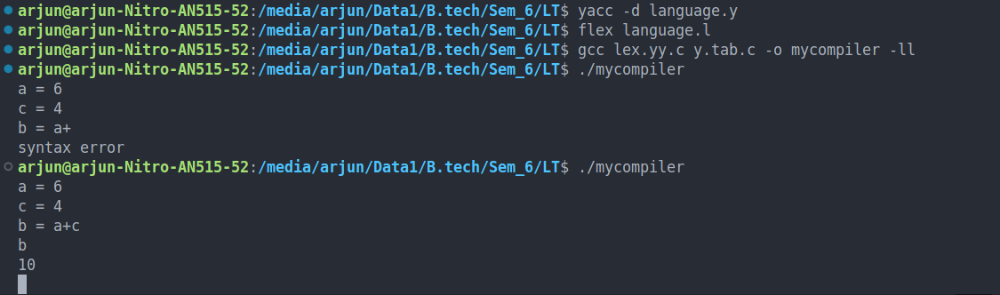

# AAV Language Compiler

**AAV-Language-Compiler** is a simple compiler for an arithmetic-based custom language. It supports arithmetic operations and allows temporary storage of variables in memory, enabling basic expression evaluation with variable assignment.

---

## Features

* Basic arithmetic operations: `+`, `-`, `*`, `/`
* Variable assignment and temporary storage
* Expression evaluation using Lex and Yacc

---

## How to Run

### 1. Install Dependencies

Make sure you have the following installed on your system:

```bash
sudo apt install flex bison gcc
```

> Note: If you're using `yacc`, replace `bison` with `yacc`.

---

### 2. Compile the Compiler

```bash
yacc -d language.y         # Generate parser
flex language.l            # Generate lexical analyzer
gcc lex.yy.c y.tab.c -o mycompiler -ll  # Compile everything
```

---

### 3. Run the Compiler

```bash
./mycompiler
```

Type your input and press `Ctrl+D` to execute.

---

## Example

Input:

```
a = 5;
b = 3;
c = a + b * 2;
```

Output:

```
a = 5
b = 3
c = 11
```

---

## Demo Screenshot



---
